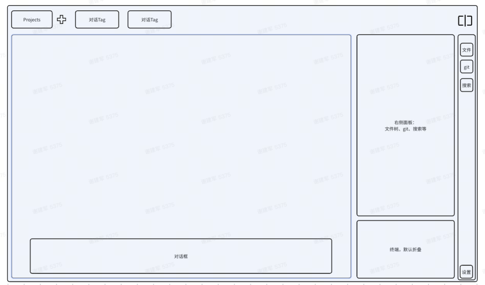

# Nex

Nex 是跨平台桌面 **Agent 工作台**（[Tauri 2](https://tauri.app/)）。核心是进程内 **Nex Agent**（OpenAI 兼容 Provider、工具、Skills、MCP、Code Graph）；同时也通过 [ACP](https://github.com/zed-industries/agent-client-protocol) 接入 Claude Code、Codex、Cursor CLI、Opencode 等外部 Agent。界面是 macOS Pro 风格的深色材质工作台。

当前发布 **1.1.9** · [Releases](https://github.com/jianjunx/nex/releases) · [源码](https://github.com/jianjunx/nex)



## 功能

### Nex Agent

已内置，不依赖外部 CLI。设置 → **Nex 智能体** 配置 Provider / 模型 / 推理力度 / MCP / Skills。

- **能力** — 多模型、推理力度、视觉；会话模式 `code` / `ask` / `plan` / `auto`。
- **工具** — 读写/编辑文件、grep / glob / ls、bash（可后台任务）、todo、checkpoint / rewind、spreadsheet、MCP 代理、子 Agent（`task` / `fleet`）。
- **Code Graph** — 进程内 tree-sitter 索引（TS/JS、Python、Rust、Go、Java），存在 `<项目>/.nex/cache/graph/`。Agent 用 `code_graph` 查定义、调用关系、影响范围。
- **上下文** — 按模型窗口做硬预算；超长 tool 输出归档可回读；结构化摘要 + session working memory。
- **Skills / 斜杠命令 / 规则** — Claude 兼容 `SKILL.md`；首次使用把内置技能和命令写到 `~/.nex`（已有文件不覆盖）。
- **MCP** — `~/.nex/mcp.json` 与 `<cwd>/.nex/mcp.json` 合并；设置里可探测、启用/禁用。
- **指令** — `~/.nex/rules/`、项目 `.nex/rules/`、根目录 `AGENTS.md`（没有则 `CLAUDE.md`）。

内置斜杠命令：`/commit` `/review` `/explain` `/fix` `/test` `/optimize`。  
内置技能：`git-commit`、`code-review`、`debug`、`refactor`、`create-skill`、`install-skill`。

### ACP 外部 Agent

从开放 ACP registry 解析启动规格；自管 Node.js 运行时（≥22）与 npm 包缓存，按 `<node> <bin>` 拉起，**不走 `npx`**。系统 PATH 里已有的 CLI 也可直接用。

### 工作台

- **多项目 × 多会话** — 左侧项目栏切换；每个项目多个对话页签；多个 Agent 可同时跑，切项目 / 对话不打断进行中的任务。项目下拉可看到最近活跃会话。
- **会话 UI** — 流式输出、思考块、工具卡片、Plan 审批、Ask 问答、权限请求按会话 FIFO 排队。Composer 支持 `@[文件]` 引用、图片粘贴/附件、斜杠命令。
- **通知** — Agent 需要确认时（尤其是收起的项目）从左上角弹出，点击跳到对应会话。
- **持久化** — 项目、会话、消息写入本地 SQLite；重启后恢复打开的页签与对话内容。

### 编辑器与文件

- 文件树（懒展开、文件图标）+ CodeMirror 多标签编辑器。
- 自动保存、查找/替换、按阈值换行、多语言格式化（Prettier / rustfmt / gofmt / ruff / shell 等）。
- 新建 / 重命名 / 复制 / 剪切 / 粘贴（重名自动加「副本」）/ 删除；可撤销；会话里的路径可点开编辑器。
- 外部文件变更防抖刷新（500ms）；`.nex/cache` 等内部写入不会刷 Git 状态。

### Git

状态、ahead/behind、Push、暂存/提交、文件 diff（可在编辑器里看）、分支切换、fetch / pull / push、clone、merge、stash、操作日志与错误详情弹窗。

### 搜索与终端

- 项目内文本搜索 + 替换；点结果跳到编辑器并高亮该行。
- 多标签 PTY 终端（xterm.js）；可配 Shell、字号、字体、回滚行数；`Ctrl+\`` 显示/隐藏。

### 设置与更新

设置（`Ctrl+,`）：外观（浅色/深色）、编辑器、终端、Nex 智能体（Provider / MCP / Skills）、快捷键录制、布局重置、关于。  
启动可检查更新，右下角横幅跳到「关于」下载安装包。快捷键可自定义并持久化。

## 扩展目录

| 位置 | 用途 |
|------|------|
| `~/.nex/skills/` | 全局用户技能（Claude 兼容 `SKILL.md`） |
| `~/.nex/commands/` | 全局斜杠命令 `*.md` |
| `~/.nex/rules/` | 全局规则，注入每个会话 |
| `~/.nex/mcp.json` | 全局 MCP 服务器 |
| `<项目>/.nex/skills/` | 项目技能（同名覆盖全局） |
| `<项目>/.nex/rules/` | 项目规则 |
| `<项目>/.nex/mcp.json` | 项目 MCP |
| `<项目>/.nex/cache/graph/` | Code Graph 索引（已 gitignore） |
| `<项目>/AGENTS.md` 或 `CLAUDE.md` | 项目给 Agent 的说明 |

Nex Agent 配置（含 API Key）在应用数据目录的 `nex-agent.json`。SQLite 也在同一目录（如 macOS `~/Library/Application Support/com.nex.app/`，Windows `%APPDATA%\com.nex.app\nex.db`）。

## 技术栈

| 层 | 技术 |
|---|---|
| 前端 | React 19 · TypeScript · Vite 8 · Tailwind CSS 4 · Zustand 5 · CodeMirror 6 · xterm.js · Radix |
| 后端 | Tauri 2 · Rust 2021 · tokio · agent-client-protocol · git2 · portable-pty · rusqlite · notify · tree-sitter |
| 存储 | SQLite（应用数据目录） |

## 仓库结构

```
src/                      前端
  features/               agent / editor / files / git / layout / projects / search / settings / terminal / updater
  stores/                 Zustand
  bridge/                 Tauri 命令与事件的类型化封装
  commands/               快捷键注册与执行
  components/ui/          共享原语
src-tauri/src/            Rust 后端
  agent/                  ACP 适配、包缓存、自管 Node、内置 Nex Agent
  graph/                  Code Graph 索引
  commands/ db/ fs/ git/ terminal/
  watcher.rs              文件防抖监听
docs/                     产品文档
CLAUDE.md                 开发约定（实现细节以这里为准）
```

## 开发

### 环境

- **Node.js** `^20.19 || ≥22.12`（Vite 8）+ `corepack enable`；Agent 运行时要求 **Node ≥ 22**
- **Rust** 稳定版 ≥ 1.77.2
- **Tauri 2 系统依赖**：Windows 10/11 自带 WebView2；其余见 [Tauri 前置条件](https://tauri.app/start/prerequisites/)

### 命令

```bash
pnpm install
pnpm tauri dev            # 或 pnpm dev:app
pnpm test                 # vitest
cd src-tauri && cargo test
pnpm lint
cd src-tauri && cargo clippy --tests
pnpm tauri build          # 或 pnpm build:installer；产物在 src-tauri/target/release/bundle/
```

仅调前端界面（没有 Tauri API）：`pnpm dev`。

### 使用

1. 打开本地项目文件夹。
2. 顶栏 **+** 新建对话：默认用 **Nex Agent**（需在 **设置 → Nex 智能体** 配好 Provider），或选外部 ACP Agent。
3. 在 Composer 里对话；权限请求在弹窗里允许 / 拒绝。
4. 右侧 **文件 / Git / 搜索**，左下角展开终端。

Windows Smart App Control 可能间歇拦截 cargo 构建脚本（os error 4551），重试即可。

## 文档

- [开发约定与架构](CLAUDE.md)
- [文档索引](docs/README.md)
